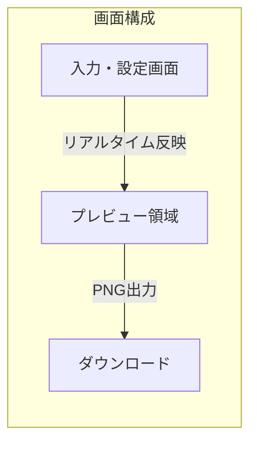

# Slackスタンプ/Discordカスタム絵文字 作成アプリ 要件定義書

## 1. 概要・目的

### 1.1 背景

SlackやDiscordでは、チーム独自のカスタムスタンプ（絵文字）を登録して使うことができる。テキストベースのスタンプは需要が高いが、画像編集ソフトを使って作るのは手間がかかる。本アプリは、1〜4文字程度のテキストを入力するだけで、スタンプ用の画像を手軽に生成・ダウンロードできるようにする。

### 1.2 目的

- 1〜4文字程度のテキストから、Slackスタンプ/Discordカスタム絵文字用の画像を生成する
- 背景色・文字色・フォント・フォントスタイル・形状などを自由にカスタマイズできる
- プリセットを用意し、初心者でも迷わずおしゃれなスタンプを作れるようにする
- 完成した画像をダウンロードし、そのままSlack/Discordに登録できるようにする

### 1.3 想定ユーザー

- Slack/Discordでカスタムスタンプ（絵文字）を作りたい人
- チームやコミュニティで使うオリジナルスタンプを手軽に量産したい人

### 1.4 Slack/Discordの仕様（参考）

| サービス | 推奨サイズ | 最大ファイルサイズ | 対応形式 |
|----------|-----------|-------------------|----------|
| Slack | 128x128px | 128KB | PNG, JPEG, GIF |
| Discord | 128x128px | 256KB | PNG, JPEG, GIF |

---

## 2. 機能要件

### 2.1 文字入力

| 項目 | 内容 |
|------|------|
| 入力文字数 | 1文字〜4文字。5文字以上の入力は不可（maxlength で制限） |
| 入力可能文字 | 半角・全角どちらも可。絵文字は不可 |
| 表示ルール | 入力した文字をすべて表示する |

### 2.2 プレビュー表示

- 入力・設定変更に応じて、リアルタイムでスタンプをプレビュー表示する
- プレビューは実際のダウンロード画像と同じ見た目で表示する
- Slack/Discordでの表示をイメージしやすいよう、小さめのプレビュー（32px〜64px相当）も併せて表示する

### 2.3 カスタマイズ項目

- **背景色**: カラーピッカーで自由に選択 + プリセットカラーの一覧から選択
- **文字色**: カラーピッカーで自由に選択 + プリセットカラーの一覧から選択
- **フォント**: 複数の Web Fonts から選択（日本語・英語それぞれ対応）
  - 最近使ったフォント5件がリストの上部に表示される（localStorage で記憶）
  - フォントの選択UIでは、各フォント名をそのフォント自体で表示し、見た目がわかるようにする
- **フォントスタイル**: 太字（Bold）/ 斜体（Italic）/ 太字斜体（Bold Italic）/ 標準（Regular）から選択
- **形状**: 以下の2種類から選択
  - 正方形（デフォルト）
  - 角丸四角（角丸の半径は固定値）
- **背景透過**: ON/OFF を切り替え可能（透過PNGで出力）

### 2.4 プリセット

- あらかじめ用意されたデザインテンプレート（背景色・文字色・フォント・フォントスタイル・形状の組み合わせ）
- 初期状態で10種類程度のプリセットを用意する
- プリセット選択後、個別のカスタマイズ項目を上書き変更できる
- プリセットの例:
  - 「ポップ」: 黄色背景 + 黒文字 + 丸ゴシック + Bold + 角丸
  - 「ビジネス」: 紺背景 + 白文字 + ゴシック + Regular + 正方形
  - 「警告」: 赤背景 + 白文字 + ゴシック + Bold + 正方形
  - 「パステル」: 薄ピンク背景 + 濃ピンク文字 + 丸ゴシック + Regular + 角丸
  - など

### 2.5 ダウンロード

- 画像形式: PNG（Slack/Discordともに対応）
- 解像度: 128x128px（Slack/Discord推奨サイズ）をデフォルトとし、256px / 512px も選択可能
- ファイルサイズ: 128KB 以下になるよう注意喚起（Slackの制限）
- ファイル名: 入力テキストを使用（例: 入力が「OK」なら `OK.png`）

### 2.6 その他機能

- レスポンシブ対応（スマホ・タブレットでも操作可能）

---

## 3. 非機能要件

### 3.1 動作環境

- モダンなブラウザ（Chrome, Firefox, Safari, Edge の最新版）
- クライアント側のみで完結（サーバー不要）

### 3.2 ホスティング・デプロイ

- **GitHub Pages** を利用して無料で公開する
- リポジトリに push するだけでデプロイが完了する構成とする
- URL例: `https://ユーザー名.github.io/リポジトリ名/`
- ビルドステップが不要な静的ファイル構成（HTML + CSS + JS）とする

### 3.3 パフォーマンス

- 入力・設定変更からプレビュー更新まで 100ms 程度で反映
- ダウンロードは即時（1秒以内）に開始できること

### 3.4 セキュリティ・プライバシー

- 画像生成はすべてクライアント（ブラウザ）内で完結し、サーバーにデータを送信しない
- 入力テキスト・画像を外部に送信しない

### 3.5 データ永続化

- 最近使ったフォント（5件）を localStorage に保存する
- localStorage が使用できない環境でも、機能自体は動作する（履歴が保存されないだけ）

### 3.6 アクセシビリティ

- キーボード操作である程度の操作が可能
- カラーコントラストは WCAG のガイドラインを考慮（背景色・文字色の組み合わせ）

---

## 4. 画面構成（案）

### レイアウト案

- **単一ページ構成**
- 上部: プレビュー表示（大：実寸、小：Slack/Discordでの見え方）
- 中部: プリセット一覧（横スクロール or グリッド）
- 下部: カスタマイズ項目
  - 文字入力
  - フォント選択（最近使ったもの5件 → 全フォント一覧）
  - フォントスタイル選択（Regular / Bold / Italic / Bold Italic）
  - 背景色・文字色（カラーピッカー + プリセットカラー）
  - 形状選択（正方形 / 角丸四角）
  - 背景透過 ON/OFF
  - 出力解像度選択
- 最下部: ダウンロードボタン

---

## 5. データ・仕様

### 5.1 入力データ

- テキスト: 文字列（最大 4文字）
- 背景色: HEX（例: `#FF5722`）
- 文字色: HEX（例: `#FFFFFF`）
- フォント名: 文字列（選択肢から選択）
- フォントスタイル: `normal` / `bold` / `italic` / `bold italic`
- 形状: `square` / `rounded`
- 背景透過: `true` / `false`
- 出力解像度: 128 / 256 / 512（数値、単位: px）

### 5.2 出力データ

- PNG 画像: Blob で生成し、`<a download>` でダウンロード

### 5.3 localStorage に保存するデータ

- 最近使ったフォント名の配列（最大5件、新しい順）

### 5.4 技術的な実装方針

- **技術スタック**: HTML + CSS + Vanilla JavaScript（ビルド不要で GitHub Pages と相性が良い）
- **プレビュー・画像生成**: HTML5 `<canvas>` を使用
- **フォント**: Google Fonts の Web Fonts を `<link>` で読み込み、canvas に適用
- **状態管理**: JavaScript の変数で管理（フレームワーク不要）
- **デプロイ**: リポジトリの `main` ブランチをそのまま GitHub Pages で配信

---

## 6. 制約・前提

- 対応言語は日本語・英語を前提とする（UI と入力テキスト）
- フォントのライセンスに注意し、Google Fonts 等の商用利用可能なフォントを使用する
- Slack/Discordのスタンプ仕様（サイズ・形式・ファイルサイズ制限）に準拠した出力を行う

---

## 7. 今後の拡張（スコープ外・検討用）

- グラデーション背景
- テキストの縁取り（アウトライン）
- アイコン作成履歴のローカル保存（localStorage）と再編集
- カスタムプリセットの保存
- PWA 化（オフライン利用）
- GIF アニメーション対応

---

## 8. 成果物イメージ

- 静的 Web アプリ（HTML + CSS + JavaScript）
- GitHub リポジトリ（GitHub Pages で公開）
- README（使い方・ローカルでの起動方法・デプロイ手順）
